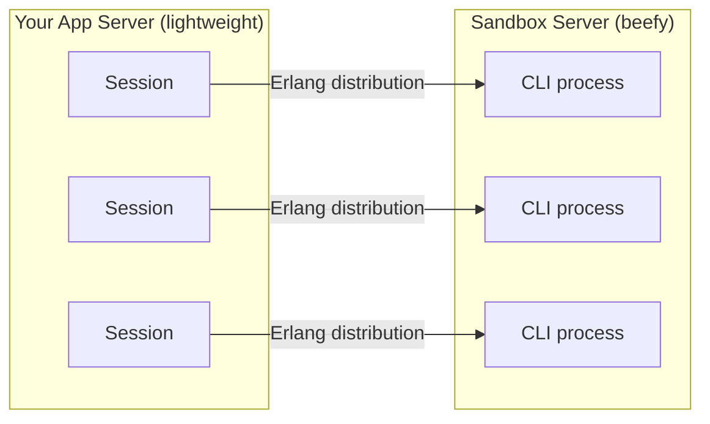

# Claude Agent SDK for Elixir

The idiomatic Elixir SDK for building AI agents with Claude. Native streams, in-process tools, OTP lifecycle management.

- **✅ Full Feature Parity** – 100% parity with the official Python and TypeScript SDKs
- **📦 Zero Setup** – Bundled CLI binary, auto-installed on first use. Just add the dep.
- **🏭 OTP Native** – Sessions are GenServers with standard OTP lifecycle management
- **🔄 Elixir Streams** – Native streaming with backpressure and composable pipelines
- **🔌 In-Process Tools & Hooks** – BEAM-native tools and lifecycle hooks with full access to application state
- **🌐 Distributed Sessions** – Offload CLI processes to remote sandboxes, scale app and CLI independently
- **⚡ Phoenix LiveView** – Stream tokens directly into LiveView and PubSub

[](https://hex.pm/packages/claude_code)
[](https://hexdocs.pm/claude_code)
[](https://github.com/guess/claude_code/blob/main/LICENSE)
[](https://elixir-lang.org)

<div align="center">
    
</div>

```elixir
{:ok, session} = ClaudeCode.start_link()

session
|> ClaudeCode.stream("Refactor the auth module and add tests")
|> ClaudeCode.Stream.text_content()
|> Enum.each(&IO.write/1)
```

## Why Elixir?

AI agents are long-lived processes that execute tools, maintain state, and stream responses. That's just OTP:

- **Sessions are GenServers** – link to a LiveView, spawn per-request, or supervise as a service
- **Elixir Streams** – backpressure, composability, and direct piping into LiveView
- **In-process tools** – direct access to Ecto repos, GenServers, and caches from inside the BEAM
- **Distributed by default** – offload heavy CLI processes to dedicated sandbox servers via Erlang distribution. Your app stays lightweight; CLI resources scale independently.

## Install

Add to `mix.exs`:

```elixir
def deps do
  [{:claude_code, "~> 0.26"}]
end
```

```bash
mix deps.get
mix claude_code.install  # optional – downloads on first use if skipped

# Authenticate (pick one)
export ANTHROPIC_API_KEY="sk-..."          # Option A: API key
"$(mix claude_code.path)" /login           # Option B: Claude subscription
```

## Quick Start

```elixir
# One-off query (ResultMessage implements String.Chars)
{:ok, result} = ClaudeCode.query("Explain GenServers in one sentence")
IO.puts(result)

# Multi-turn session with streaming
{:ok, session} = ClaudeCode.start_link()

session |> ClaudeCode.stream("My favorite language is Elixir") |> Stream.run()

session
|> ClaudeCode.stream("What's my favorite language?")
|> ClaudeCode.Stream.text_content()
|> Enum.each(&IO.write/1)
# => "Your favorite language is Elixir!"
```

## Features

### In-Process Custom Tools

Define tools that run inside your BEAM VM. They have direct access to your Ecto repos, GenServers, caches – anything in your application.

```elixir
defmodule MyApp.Tools do
  use ClaudeCode.MCP.Server, name: "app-tools"

  tool :query_user, "Look up a user by email" do
    field :email, :string, required: true

    def execute(%{email: email}) do
      case MyApp.Repo.get_by(MyApp.User, email: email) do
        nil -> {:error, "User not found"}
        user -> {:ok, "#{user.name} (#{user.email})"}
      end
    end
  end
end

{:ok, result} = ClaudeCode.query("Find alice@example.com",
  mcp_servers: %{"app-tools" => MyApp.Tools},
  allowed_tools: ["mcp__app-tools__*"]
)
```

Pass per-session context via assigns for scoped tools in LiveView:

```elixir
{:ok, session} = ClaudeCode.start_link(
  mcp_servers: %{
    "app-tools" => %{module: MyApp.Tools, assigns: %{scope: current_scope}}
  }
)
```

[Custom tools guide →](docs/guides/custom-tools.md) | [MCP guide →](docs/guides/mcp.md)

### Real-Time Streaming

Native Elixir Streams with character-level deltas, composable pipelines, and direct LiveView integration:

```elixir
# Character-level streaming
session
|> ClaudeCode.stream("Explain recursion", include_partial_messages: true)
|> ClaudeCode.Stream.text_deltas()
|> Enum.each(&IO.write/1)

# Phoenix LiveView
pid = self()
Task.start(fn ->
  session
  |> ClaudeCode.stream(message, include_partial_messages: true)
  |> ClaudeCode.Stream.text_deltas()
  |> Enum.each(&send(pid, {:chunk, &1}))
end)

# PubSub broadcasting
session
|> ClaudeCode.stream("Generate report", include_partial_messages: true)
|> ClaudeCode.Stream.text_deltas()
|> Enum.each(&Phoenix.PubSub.broadcast(MyApp.PubSub, "chat:#{id}", {:chunk, &1}))
```

Stream helpers: `text_deltas/1`, `thinking_deltas/1`, `text_content/1`, `tool_uses/1`, `final_text/1`, `collect/1`, `buffered_text/1`, and more.

[Streaming guide →](docs/guides/streaming-output.md)

### Subagents

Define specialized agents with isolated contexts, restricted tools, and independent model selection. Claude automatically delegates tasks based on each agent's description.

```elixir
alias ClaudeCode.Agent

{:ok, session} = ClaudeCode.start_link(
  agents: [
    Agent.new(
      name: "code-reviewer",
      description: "Expert code reviewer. Use for quality and security reviews.",
      prompt: "You are a code review specialist. Focus on security and best practices.",
      tools: ["Read", "Grep", "Glob"],
      model: "sonnet"
    ),
    Agent.new(
      name: "test-runner",
      description: "Runs and analyzes test suites.",
      prompt: "Run tests and provide clear analysis of results.",
      tools: ["Bash", "Read", "Grep"]
    )
  ],
  allowed_tools: ["Read", "Grep", "Glob", "Task"]
)
```

[Subagents guide →](docs/guides/subagents.md)

### Hooks and Permissions

Intercept every tool execution with `can_use_tool` for programmatic approval, or use lifecycle hooks for auditing, budget guards, and more:

```elixir
{:ok, session} = ClaudeCode.start_link(
  # Programmatic tool approval
  can_use_tool: fn %{tool_name: name}, _id ->
    if name in ["Read", "Glob", "Grep"], do: :allow, else: {:deny, "Read-only mode"}
  end,
  # Lifecycle hooks
  hooks: %{
    PostToolUse: [%{hooks: [MyApp.AuditLogger]}],
    Stop: [%{hooks: [MyApp.BudgetGuard]}]
  }
)
```

Six [permission modes](docs/guides/permissions.md) plus fine-grained tool allow/deny lists with glob patterns:

```elixir
{:ok, session} = ClaudeCode.start_link(
  permission_mode: :accept_edits,
  allowed_tools: ["Read", "Edit", "Bash(git:*)"]
)
```

[Hooks guide →](docs/guides/hooks.md) | [Permissions guide →](docs/guides/permissions.md)

### Structured Outputs

Get typed JSON data from agent workflows using JSON Schema. The agent uses tools autonomously, then returns structured results:

```elixir
schema = %{
  "type" => "object",
  "properties" => %{
    "todos" => %{
      "type" => "array",
      "items" => %{
        "type" => "object",
        "properties" => %{
          "text" => %{"type" => "string"},
          "file" => %{"type" => "string"},
          "line" => %{"type" => "number"}
        },
        "required" => ["text", "file", "line"]
      }
    },
    "total_count" => %{"type" => "number"}
  },
  "required" => ["todos", "total_count"]
}

{:ok, result} = ClaudeCode.query(
  "Find all TODO comments in this codebase",
  output_format: %{type: :json_schema, schema: schema}
)

result.structured_output
# %{"todos" => [...], "total_count" => 12}
```

[Structured outputs guide →](docs/guides/structured-outputs.md)

### Session Management

Resume conversations, fork sessions, and read history:

```elixir
{:ok, session} = ClaudeCode.start_link()
session |> ClaudeCode.stream("Remember: the code is 12345") |> Stream.run()

# Save session ID, stop, resume later
session_id = ClaudeCode.get_session_id(session)
ClaudeCode.stop(session)

{:ok, resumed} = ClaudeCode.start_link(resume: session_id)

# Fork a conversation into a new branch
{:ok, forked} = ClaudeCode.start_link(resume: session_id, fork_session: true)

# Runtime controls without restarting
ClaudeCode.set_model(session, "claude-sonnet-4-5-20250929")
ClaudeCode.set_permission_mode(session, :accept_edits)
```

[Sessions guide →](docs/guides/sessions.md)

### Cost Controls

Track per-model usage, set budget limits, and cap turn counts:

```elixir
{:ok, session} = ClaudeCode.start_link(
  max_turns: 10,
  max_budget_usd: 1.00
)

result = session
|> ClaudeCode.stream("Analyze this codebase")
|> ClaudeCode.Stream.final_result()

IO.puts("Total cost: $#{result.total_cost_usd}")

Enum.each(result.model_usage, fn {model, usage} ->
  IO.puts("#{model}: $#{usage.cost_usd} (#{usage.output_tokens} output tokens)")
end)
```

[Cost tracking guide →](docs/guides/cost-tracking.md)

### File Checkpointing

Track file changes during agent sessions and rewind to any previous state:

```elixir
{:ok, session} = ClaudeCode.start_link(
  enable_file_checkpointing: true,
  permission_mode: :accept_edits
)

# Stream emits a UserMessage with a uuid before each tool execution.
# Capture it to use as a checkpoint for rewinding.
messages = session
|> ClaudeCode.stream("Refactor the authentication module")
|> Enum.to_list()

checkpoint_id =
  Enum.find_value(messages, fn
    %ClaudeCode.Message.UserMessage{uuid: uuid} when is_binary(uuid) -> uuid
    _ -> nil
  end)

# Undo all file changes back to that checkpoint
ClaudeCode.rewind_files(session, checkpoint_id)
```

[File checkpointing guide →](docs/guides/file-checkpointing.md)

### MCP Integration

Connect to any MCP server – stdio, HTTP, SSE, in-process, or Hermes modules. Mix all transport types in a single session:

```elixir
{:ok, session} = ClaudeCode.start_link(
  mcp_servers: %{
    "app-tools" => MyApp.Tools,                                           # In-process
    "github" => %{command: "npx", args: ["-y", "@modelcontextprotocol/server-github"],
                  env: %{"GITHUB_TOKEN" => System.get_env("GITHUB_TOKEN")}},  # stdio
    "docs" => %{type: "http", url: "https://code.claude.com/docs/mcp"}   # HTTP
  },
  allowed_tools: ["mcp__app-tools__*", "mcp__github__*", "mcp__docs__*"]
)
```

[MCP guide →](docs/guides/mcp.md)

### Distributed Sessions

Every session spawns a Claude CLI subprocess — a Node.js process that consumes real CPU and memory. On a single machine, your concurrency is capped by CLI overhead, not the BEAM. Distributed sessions fix this:



One line changes in your code — everything else stays the same:

```elixir
{:ok, session} = ClaudeCode.start_link(
  cwd: "/workspaces/#{tenant_id}",
  adapter: {ClaudeCode.Adapter.Node, [node: :"claude@sandbox-server"]}
)

# Same API — streaming, tools, hooks, resumption all work unchanged
session
|> ClaudeCode.stream("Analyze the codebase")
|> ClaudeCode.Stream.text_content()
|> Enum.each(&IO.write/1)
```

Your app server runs only GenServers. All CLI resource consumption lives on dedicated hardware you size and scale independently. `GenServer.call/2` and `send/2` work transparently across BEAM nodes — no custom protocol, no WebSocket, no sidecar.

[Distributed sessions guide →](docs/guides/distributed-sessions.md) | [Hosting guide →](docs/guides/hosting.md)

### And More

- **[Slash commands](docs/guides/slash-commands.md)** – Custom `/commands` with arguments, file references, and bash execution
- **[Skills](docs/guides/skills.md)** – Filesystem-based capabilities Claude invokes autonomously
- **[Plugins](docs/guides/plugins.md)** – Package commands, agents, skills, hooks, and MCP servers for sharing
- **[System prompts](docs/guides/modifying-system-prompts.md)** – Override, append, or use CLAUDE.md for project-level instructions
- **[Secure deployment](docs/guides/secure-deployment.md)** – Sandboxing, least-privilege tools, audit trails, and ephemeral sessions

## Testing

Built-in test adapter for fast, deterministic tests without API calls:

```elixir
test "handles greeting" do
  ClaudeCode.Test.stub(ClaudeCode, fn _query, _opts ->
    [ClaudeCode.Test.text("Hello! How can I help?")]
  end)

  {:ok, session} = ClaudeCode.start_link()
  result = session |> ClaudeCode.stream("Hi") |> ClaudeCode.Stream.final_text()
  assert result == "Hello! How can I help?"
end
```

Includes message helpers (`text`, `tool_use`, `tool_result`, `thinking`), dynamic stubs, and concurrent test support.

[Testing guide →](docs/reference/testing.md)

## Documentation

- **[Documentation Hub](docs/README.md)** – All guides and references
- **[API Reference](https://hexdocs.pm/claude_code)** – Complete API docs on HexDocs
- **[Examples](docs/reference/examples.md)** – Real-world usage patterns
- **[Troubleshooting](docs/reference/troubleshooting.md)** – Common issues and solutions

## Contributing

We welcome contributions! Bug reports, feature requests, documentation improvements, and code contributions are all appreciated.

See our [Contributing Guide](https://github.com/guess/claude_code/blob/main/CONTRIBUTING.md) to get started.

## Development

```bash
git clone https://github.com/guess/claude_code.git
cd claude_code
mix deps.get
mix test
mix quality  # format, credo, dialyzer
```

## License

MIT License – see [LICENSE](https://github.com/guess/claude_code/blob/main/LICENSE) for details.

---

Built for Elixir developers on top of the [Claude Code CLI](https://github.com/anthropics/claude-code).
