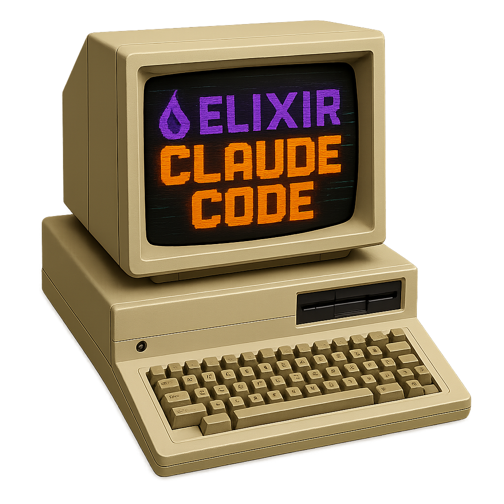

# Claude Code SDK for Elixir

[](https://hex.pm/packages/claude_code)
[](https://hexdocs.pm/claude_code)
[](LICENSE)
[](https://elixir-lang.org)

<div align="center">
    
</div>

ClaudeCode provides a GenServer-based interface to the Claude Code CLI with support for streaming responses, concurrent queries, and Phoenix LiveView integration.

## Prerequisites

1. **Install Claude Code CLI**:
   - Visit [claude.ai/code](https://claude.ai/code)
   - Follow the installation instructions for your platform
   - Verify installation: `claude --version`

2. **Get an API Key**:
   - Sign up at [console.anthropic.com](https://console.anthropic.com)
   - Create an API key and configure it (see Configuration section below)

## Installation

Add to your `mix.exs`:

```elixir
def deps do
  [
    {:claude_code, "~> 0.2.0"}
  ]
end
```

Then run:
```bash
mix deps.get
```

## Quick Start

### Configuration

First, configure your API key. Choose one of these methods:

**Method 1: Application Configuration (Recommended)**
```elixir
# config/config.exs
config :claude_code, api_key: "sk-ant-your-api-key-here"
```

**Method 2: Environment Variable**
```bash
export ANTHROPIC_API_KEY="sk-ant-your-api-key-here"
```

### Basic Usage

```elixir
# Start a session (using app config)
{:ok, session} = ClaudeCode.start_link()

# Or with explicit API key
{:ok, session} = ClaudeCode.start_link(
  api_key: System.get_env("ANTHROPIC_API_KEY")
)

# Send a query and get a response
{:ok, response} = ClaudeCode.query(session, "Hello, Claude!")
IO.puts(response)
# => "Hello! How can I assist you today?"

# Stop the session when done
ClaudeCode.stop(session)
```

### Advanced Configuration

Configure sessions with various options:

```elixir
# Session with custom configuration
{:ok, session} = ClaudeCode.start_link(
  model: "opus",
  system_prompt: "You are an Elixir expert",
  allowed_tools: ["View", "Edit", "Bash(git:*)"],
  add_dir: ["/tmp", "/var/log"],
  timeout: 120_000,
  permission_mode: :default
)

# Use application configuration for defaults
# config/config.exs
config :claude_code,
  api_key: "sk-ant-your-api-key-here",
  model: "opus",
  timeout: 180_000,
  system_prompt: "You are a helpful Elixir assistant",
  allowed_tools: ["View", "Edit", "Bash(git:*)"],
  add_dir: ["/tmp"]

# Session automatically uses configured defaults
{:ok, session} = ClaudeCode.start_link()
```

### Streaming Responses

Process responses as they arrive:

```elixir
# Stream text content
session
|> ClaudeCode.query_stream("Explain GenServers in Elixir")
|> ClaudeCode.Stream.text_content()
|> Enum.each(&IO.write/1)

# React to tool usage in real-time
session
|> ClaudeCode.query_stream("Create a new Elixir module")
|> ClaudeCode.Stream.tool_uses()
|> Enum.each(fn tool_use ->
  IO.puts("Claude is using: #{tool_use.name}")
end)

# Query with additional directory access and custom tools
session
|> ClaudeCode.query_stream("Analyze the log files and create a summary report",
  add_dir: ["/var/log", "/tmp/analysis"],
  allowed_tools: ["View", "Edit"],
  timeout: 180_000
)
|> ClaudeCode.Stream.text_content()
|> Enum.each(&IO.write/1)

# Handle all message types
session
|> ClaudeCode.query_stream("Help me debug this code")
|> Enum.each(fn
  %ClaudeCode.Message.Assistant{message: %{content: content}} ->
    # Process assistant response
  %ClaudeCode.Message.Result{result: result} ->
    # Final result
  _ ->
    # Other message types
    :ok
end)
```

### Query-Level Overrides

Override session defaults for specific queries:

```elixir
# Override options per query
{:ok, response} = ClaudeCode.query(session, "Complex task",
  system_prompt: "Focus on performance optimization",
  timeout: 300_000,
  allowed_tools: ["Bash(git:*)"]
)
```

## Session Continuity

ClaudeCode automatically maintains conversation context across queries within a session, just like the interactive Claude CLI. No configuration required!

### Automatic Conversation Continuity

```elixir
{:ok, session} = ClaudeCode.start_link(api_key: "sk-ant-...")

# First query establishes the conversation
{:ok, response1} = ClaudeCode.query(session, "Hello, my name is Alice")
# => "Hello Alice! Nice to meet you."

# Subsequent queries remember the conversation context
{:ok, response2} = ClaudeCode.query(session, "What's my name?")
# => "Your name is Alice, as you mentioned when we first met."

# Context is maintained across streaming queries too
session
|> ClaudeCode.query_stream("Tell me more about yourself")
|> ClaudeCode.Stream.text_content()
|> Enum.each(&IO.write/1)
# Claude remembers the previous conversation
```

### Session Management API

When you need explicit control over conversation context:

```elixir
# Check current session ID (for debugging/logging)
{:ok, session_id} = ClaudeCode.get_session_id(session)
# => {:ok, "abc123-def456-session-id"}

# For a new session with no queries yet
{:ok, nil} = ClaudeCode.get_session_id(session)

# First query establishes the conversation
{:ok, response1} = ClaudeCode.query(session, "Hello, my name is Alice")
# => "Hello Alice! Nice to meet you."

# Subsequent queries remember the conversation context
{:ok, response2} = ClaudeCode.query(session, "What's my name?")
# => "Your name is Alice, as you mentioned when we first met."

# Clear session to start a fresh conversation
:ok = ClaudeCode.clear(session)

# Next query starts with no previous context
{:ok, response} = ClaudeCode.query(session, "What's my name?")
# => "I don't have any information about your name..."
```

### How It Works

- **Automatic**: Session IDs are captured from Claude CLI responses and automatically used for subsequent queries
- **Transparent**: Uses the CLI's `--resume` flag internally - no API changes needed
- **Persistent**: Sessions persist for the lifetime of the GenServer process
- **Stateful by Default**: Conversations continue naturally, matching interactive CLI behavior

This provides the same conversational experience as using Claude Code interactively, but programmatically within your Elixir applications.

## Options Reference

For complete documentation of all available options, see the `ClaudeCode.Options` module:

```elixir
# View session options schema
ClaudeCode.Options.session_schema()

# View query options schema
ClaudeCode.Options.query_schema()
```

**Key points:**
- `:api_key` is required and can be provided via session options or application config
- Query options can override session defaults
- Some options (`:timeout`, `:name`) are Elixir-specific
- Most options map directly to Claude CLI flags

Run `mix docs` and navigate to `ClaudeCode.Options` for detailed option documentation including types, defaults, and validation rules.

## API Reference

### ClaudeCode Module

```elixir
# Start a session
ClaudeCode.start_link(opts)
# See ClaudeCode.Options.session_schema() for all available options

# Synchronous query (blocks until complete)
ClaudeCode.query(session, prompt, opts \\ [])
# Returns: {:ok, String.t()} | {:error, term()}

# Streaming query (returns Elixir Stream)
ClaudeCode.query_stream(session, prompt, opts \\ [])
# Returns: Stream.t()

# Async query (sends messages to calling process)
ClaudeCode.query_async(session, prompt, opts \\ [])
# Returns: {:ok, reference()} | {:error, term()}

# Session management
ClaudeCode.alive?(session)         # Check if session is running
ClaudeCode.stop(session)           # Stop the session
ClaudeCode.get_session_id(session) # Get current session ID for conversation continuity
ClaudeCode.clear(session)  # Clear session to start fresh conversation
```

### ClaudeCode.Stream Module

```elixir
# Extract text content from responses
ClaudeCode.Stream.text_content(stream)

# Extract tool usage blocks
ClaudeCode.Stream.tool_uses(stream)

# Filter messages by type
ClaudeCode.Stream.filter_type(stream, :assistant)

# Buffer text until sentence boundaries
ClaudeCode.Stream.buffered_text(stream)
```

## Error Handling

```elixir
case ClaudeCode.query(session, "Hello") do
  {:ok, response} ->
    IO.puts(response)
  {:error, :timeout} ->
    IO.puts("Request timed out")
  {:error, {:cli_not_found, msg}} ->
    IO.puts("CLI error: #{msg}")
  {:error, {:claude_error, msg}} ->
    IO.puts("Claude error: #{msg}")
end
```

## Documentation

- 🚀 **[Getting Started](docs/GETTING_STARTED.md)** - Step-by-step tutorial for new users
- 💻 **[Examples](docs/EXAMPLES.md)** - Real-world usage patterns and code samples
- 🔧 **[Troubleshooting](docs/TROUBLESHOOTING.md)** - Common issues and solutions

## Production Usage

### Performance & Concurrency

ClaudeCode is designed for production use with multiple concurrent sessions:

```elixir
# Multiple sessions for parallel processing
sessions = 1..4 |> Enum.map(fn _i ->
  {:ok, session} = ClaudeCode.start_link()
  session
end)

# Process tasks in parallel
results = Task.async_stream(tasks, fn task ->
  session = Enum.random(sessions)  # Simple load balancing
  ClaudeCode.query(session, task.prompt)
end, max_concurrency: 4)

# Clean up
Enum.each(sessions, &ClaudeCode.stop/1)
```

### Phoenix Integration

Add ClaudeCode to your supervision tree for web applications:

```elixir
# lib/my_app/application.ex
def start(_type, _args) do
  children = [
    MyAppWeb.Endpoint,
    {ClaudeCode, [name: :claude_session]}
  ]

  Supervisor.start_link(children, strategy: :one_for_one)
end

# Use in controllers/live views
ClaudeCode.query(:claude_session, prompt)
```

### Best Practices

1. **Session Management:**
   ```elixir
   # Use named sessions for long-running processes
   {:ok, _} = ClaudeCode.start_link(name: :main_claude)

   # Use temporary sessions for isolated tasks
   {:ok, temp} = ClaudeCode.start_link()
   result = ClaudeCode.query(temp, prompt)
   ClaudeCode.stop(temp)
   ```

2. **Error Handling:**
   ```elixir
   defp safe_claude_query(session, prompt) do
     case ClaudeCode.query(session, prompt, timeout: 30_000) do
       {:ok, response} -> {:ok, response}
       {:error, :timeout} -> {:error, "Request timed out"}
       {:error, reason} -> {:error, "Claude error: #{inspect(reason)}"}
     end
   end
   ```

3. **Resource Management:**
   ```elixir
   # Always clean up sessions
   try do
     {:ok, session} = ClaudeCode.start_link()
     # ... use session
   after
     ClaudeCode.stop(session)
   end
   ```

## Development

```bash
# Clone and install dependencies
git clone https://github.com/guess/claude_code.git
cd claude_code
mix deps.get

# Run tests
mix test

# Run quality checks (format, credo, dialyzer)
mix quality
```

## Contributing

We welcome contributions! Please:

1. Pick an unimplemented feature or bug fix
2. Open an issue to discuss your approach
3. Submit a PR with tests and documentation

## License

MIT License

## Architecture

The SDK uses a GenServer-based architecture where each Claude session is a separate process that spawns the Claude CLI as a subprocess. Communication happens via JSON streaming over stdout, with the CLI process exiting after each query (stateless).

```
┌─────────────┐     ┌─────────────────┐     ┌──────────────┐
│ Your Code   │────▶│ ClaudeCode API  │────▶│ Session      │
└─────────────┘     └─────────────────┘     │ (GenServer)  │
                                            └──────┬───────┘
                                                   │
                                            ┌──────▼───────┐
                                            │ CLI Process  │
                                            │ (Port)       │
                                            └──────────────┘
```

Built on top of the [Claude Code CLI](https://github.com/anthropics/claude-code) and designed for the Elixir community.
