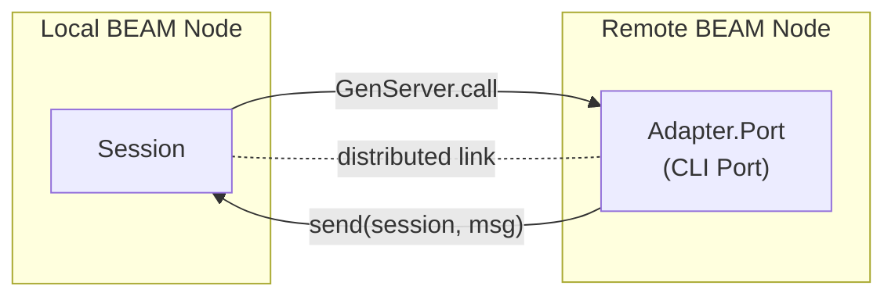

# Distributed Sessions

Run Claude Code sessions on remote BEAM nodes via Erlang distribution.

`ClaudeCode.Adapter.Node` connects to a remote BEAM node, creates a workspace directory, and starts `ClaudeCode.Adapter.Port` there. After startup, Session talks directly to the remote adapter — `GenServer.call/2` and `send/2` work transparently across connected BEAM nodes. No custom protocol, no sidecar package, no WebSocket.

## Prerequisites

- **Remote BEAM node** running OTP 25+ with the `claude_code` dependency installed
- **Claude Code CLI** installed on the remote node (via `mix claude_code.install` or globally)
- **Erlang distribution** enabled on both nodes (named nodes with a shared cookie)
- **Network connectivity** between nodes (the Erlang distribution port, typically 4369 for EPMD plus dynamic ports)

## Quick Start

Start a named local node and connect to a remote node running the Claude CLI:

```elixir
# On the remote node (already running as claude@gpu-server):
# Ensure claude_code is in deps and CLI is installed

# On your local node:
{:ok, session} = ClaudeCode.start_link(
  cwd: "/workspaces/my-project",
  model: "claude-sonnet-4-20250514",
  adapter: {ClaudeCode.Adapter.Node, [
    node: :"claude@gpu-server"
  ]}
)

# Works identically to a local session
response =
  session
  |> ClaudeCode.stream("Hello from across the cluster!")
  |> ClaudeCode.Stream.final_text()
```

Everything after `start_link` is the same API you already know — `ClaudeCode.stream/3`, `ClaudeCode.Stream` utilities, session resumption, and runtime control all work unchanged.

## Configuration Reference

### Node-specific options

These are consumed by `ClaudeCode.Adapter.Node` and **not** forwarded to the remote adapter:

| Option | Type | Required | Default | Description |
|--------|------|----------|---------|-------------|
| `:node` | atom | yes | — | Remote node name (e.g., `:"claude@gpu-server"`) |
| `:cookie` | atom | no | — | Erlang cookie for the remote node (if not already set globally) |
| `:connect_timeout` | integer | no | 5000 | Timeout in ms for `Node.connect/1` |

### Session options

All standard session options (`:model`, `:cwd`, `:system_prompt`, etc.) are passed to `ClaudeCode.start_link/1` as usual. Session automatically merges them into the adapter config. See `ClaudeCode.Options` for the full list.

The `:cwd` option is required for distributed sessions — it specifies the working directory on the remote node, which is auto-created if it doesn't exist.

```elixir
{:ok, session} = ClaudeCode.start_link(
  name: :remote_claude,
  cwd: "/workspaces/project",
  model: "claude-sonnet-4-20250514",
  permission_mode: :dont_ask,
  allowed_tools: ["Read", "Glob", "Grep"],
  adapter: {ClaudeCode.Adapter.Node, [
    node: :"claude@gpu-server"
  ]}
)
```

## Architecture



### What runs where

| Component | Node | Notes |
|-----------|------|-------|
| `ClaudeCode.Session` | Local | GenServer managing lifecycle and message parsing |
| `ClaudeCode.Adapter.Node` | Local | Factory only — no long-lived process |
| `ClaudeCode.Adapter.Port` | Remote | Owns the CLI Port, sends raw JSON to Session |
| Claude CLI subprocess | Remote | Spawned by Adapter.Port via Erlang Port |
| Hooks | Remote | Execute where the CLI runs |

`ClaudeCode.Adapter.Node` is a **factory**, not a long-running process. During `start_link/2`, it connects to the remote node, creates the workspace directory via RPC, and starts `ClaudeCode.Adapter.Port` on the remote node. It then returns the remote PID. From that point on, Session communicates directly with the remote `ClaudeCode.Adapter.Port` — all calls and messages flow over Erlang distribution transparently.

## Production Patterns

### Single sandbox server, multiple workspaces

Run a single remote BEAM node as a sandbox server. Each tenant gets an isolated workspace directory:

```elixir
defmodule MyApp.Claude do
  @sandbox_node :"claude@sandbox-server"

  def start_session(tenant_id, opts \\ []) do
    opts =
      Keyword.merge([
        cwd: "/workspaces/#{tenant_id}",
        permission_mode: :dont_ask,
        allowed_tools: ["Read", "Edit", "Write", "Glob", "Grep", "Bash"],
        adapter: {ClaudeCode.Adapter.Node, [node: @sandbox_node]}
      ], opts)

    ClaudeCode.start_link(opts)
  end
end

# Each tenant gets a separate session with its own workspace
{:ok, session_a} = MyApp.Claude.start_session("tenant-a")
{:ok, session_b} = MyApp.Claude.start_session("tenant-b")
```

### Per-user sessions in Phoenix LiveView

Start a remote Claude session when a user connects, stream responses back through the LiveView:

```elixir
defmodule MyAppWeb.ChatLive do
  use MyAppWeb, :live_view

  def mount(_params, %{"user_id" => user_id}, socket) do
    {:ok, session} = ClaudeCode.start_link(
      cwd: "/workspaces/#{user_id}",
      model: "claude-sonnet-4-20250514",
      permission_mode: :dont_ask,
      adapter: {ClaudeCode.Adapter.Node, [node: :"claude@sandbox"]}
    )

    {:ok, assign(socket, claude: session, response: "", streaming: false)}
  end

  def handle_event("send", %{"message" => msg}, socket) do
    if socket.assigns.streaming do
      {:noreply, socket}
    else
      lv = self()

      Task.Supervisor.start_child(MyApp.TaskSupervisor, fn ->
        try do
          socket.assigns.claude
          |> ClaudeCode.stream(msg, include_partial_messages: true)
          |> ClaudeCode.Stream.text_deltas()
          |> Enum.each(&send(lv, {:chunk, &1}))

          send(lv, :stream_done)
        catch
          kind, reason ->
            send(lv, {:stream_error, {kind, reason}})
        end
      end)

      {:noreply, assign(socket, response: "", streaming: true)}
    end
  end

  def handle_info({:chunk, chunk}, socket) do
    {:noreply, assign(socket, response: socket.assigns.response <> chunk)}
  end

  def handle_info(:stream_done, socket) do
    {:noreply, assign(socket, streaming: false)}
  end

  def handle_info({:stream_error, _reason}, socket) do
    {:noreply, assign(socket, streaming: false)}
  end
end
```

This requires a `Task.Supervisor` in your application supervision tree:

```elixir
# lib/my_app/application.ex
children = [
  {Task.Supervisor, name: MyApp.TaskSupervisor},
  # ...
]
```

When the LiveView process terminates (user disconnects), the session and its remote CLI subprocess clean up automatically via process linking. The `Task.Supervisor` ensures streaming tasks are monitored — if one crashes, the LiveView receives `{:stream_error, _}` instead of silently hanging.

### Supervised remote sessions with DynamicSupervisor

Use a `DynamicSupervisor` to manage remote sessions with automatic restart:

```elixir
defmodule MyApp.ClaudeSupervisor do
  use DynamicSupervisor

  def start_link(init_arg) do
    DynamicSupervisor.start_link(__MODULE__, init_arg, name: __MODULE__)
  end

  @impl true
  def init(_init_arg) do
    DynamicSupervisor.init(strategy: :one_for_one)
  end

  def start_session(tenant_id, opts \\ []) do
    session_opts =
      Keyword.merge([
        cwd: "/workspaces/#{tenant_id}",
        adapter: {ClaudeCode.Adapter.Node, [node: :"claude@sandbox"]}
      ], opts)

    DynamicSupervisor.start_child(__MODULE__, {ClaudeCode.Session, session_opts})
  end

  def stop_session(pid) do
    DynamicSupervisor.terminate_child(__MODULE__, pid)
  end
end
```

### Session resumption across reconnects

Store the session ID and resume after a disconnect or node restart:

```elixir
# First session
{:ok, session} = ClaudeCode.start_link(
  cwd: "/workspaces/tenant-123",
  model: "claude-sonnet-4-20250514",
  adapter: {ClaudeCode.Adapter.Node, [node: :"claude@sandbox"]}
)

session |> ClaudeCode.stream("Set up a Phoenix project") |> Stream.run()
session_id = ClaudeCode.get_session_id(session)
ClaudeCode.stop(session)

# Later — resume the conversation on the same (or different) remote node
{:ok, session} = ClaudeCode.start_link(
  resume: session_id,
  cwd: "/workspaces/tenant-123",
  model: "claude-sonnet-4-20250514",
  adapter: {ClaudeCode.Adapter.Node, [node: :"claude@sandbox"]}
)

session
|> ClaudeCode.stream("Add authentication to the project")
|> ClaudeCode.Stream.final_text()
```

> **Note:** Session history is stored on the machine where the CLI runs (the remote node). Resuming requires the same `:cwd` so the CLI can find the stored conversation.

## Setting Up the Remote Node

### 1. Install dependencies

The remote node needs `claude_code` as a dependency and the CLI binary installed:

```bash
# In your remote application's mix.exs, add:
# {:claude_code, "~> 0.26"}

# Then install the CLI
mix deps.get
mix claude_code.install
```

### 2. Start as a named node

```bash
# Start the remote node with a name and cookie
elixir --name claude@gpu-server --cookie my_secret -S mix run --no-halt
```

Or in a release:

```bash
# rel/env.sh.eex
export RELEASE_NODE="claude@$(hostname -f)"
export RELEASE_COOKIE="my_secret"
export ANTHROPIC_API_KEY="sk-ant-..."
```

### 3. Verify connectivity

From your local node, confirm you can connect:

```elixir
# Start your local node
# iex --name app@localhost --cookie my_secret -S mix

Node.connect(:"claude@gpu-server")
# => true

# Verify the CLI is available on the remote node
:rpc.call(:"claude@gpu-server", ClaudeCode.Adapter.Port.Resolver, :find_binary, [[]])
# => {:ok, "/path/to/claude"}
```

## Failure Handling

### Node down

When the remote node goes down, the distributed link between Session and the remote `ClaudeCode.Adapter.Port` fires. Session receives `{:EXIT, pid, :noconnection}` and handles it like any adapter crash — the active request completes with an error.

```elixir
# If the remote node goes down during a query:
session
|> ClaudeCode.stream("Do something")
|> Enum.to_list()
# => receives {:stream_error, {:adapter_error, :noconnection}}
```

### Network partition

From BEAM's perspective, a network partition is indistinguishable from a node going down. The distributed link fires and the adapter is considered dead.

### CLI not found on remote node

If the Claude CLI binary isn't installed on the remote node, `ClaudeCode.Adapter.Port` fails during startup. The error propagates through RPC back to the caller:

```elixir
case ClaudeCode.start_link(
  cwd: "/workspaces/test",
  adapter: {ClaudeCode.Adapter.Node, [node: :"claude@gpu-server"]}
) do
  {:ok, session} -> session
  {:error, {:cli_not_found, message}} -> IO.puts(message)
end
```

### RPC failures

If the remote node is unreachable or the RPC call fails:

```elixir
{:error, reason} = ClaudeCode.start_link(
  cwd: "/workspaces/test",
  adapter: {ClaudeCode.Adapter.Node, [
    node: :"unreachable@server",
    connect_timeout: 3_000
  ]}
)

# reason will be one of:
# {:connect_timeout, :"unreachable@server"}
# {:node_connect_failed, :"unreachable@server"}
# {:rpc_failed, reason}
```

### No automatic reconnection

There is no automatic reconnection. If the remote node goes down, create a new Session to reconnect. Use `:resume` with the stored session ID to continue the conversation:

```elixir
# Reconnect after failure
{:ok, session} = ClaudeCode.start_link(
  resume: saved_session_id,
  cwd: "/workspaces/tenant-123",
  adapter: {ClaudeCode.Adapter.Node, [node: :"claude@gpu-server"]}
)
```

## Streaming

All `ClaudeCode.Stream` utilities work identically over distributed sessions. Messages flow from the remote `ClaudeCode.Adapter.Port` to the local Session via Erlang distribution — the stream API doesn't know or care where the adapter is running.

```elixir
{:ok, session} = ClaudeCode.start_link(
  cwd: "/workspaces/project",
  adapter: {ClaudeCode.Adapter.Node, [node: :"claude@sandbox"]}
)

# Text content streaming
session
|> ClaudeCode.stream("Explain GenServer")
|> ClaudeCode.Stream.text_content()
|> Enum.each(&IO.write/1)

# Character-level deltas
session
|> ClaudeCode.stream("Write a haiku", include_partial_messages: true)
|> ClaudeCode.Stream.text_deltas()
|> Enum.each(&IO.write/1)

# Tool use tracking
session
|> ClaudeCode.stream("Read the README.md file")
|> ClaudeCode.Stream.tool_uses()
|> Enum.each(fn %ClaudeCode.Content.ToolUseBlock{name: name, input: input} ->
  IO.puts("Tool: #{name}, Input: #{inspect(input)}")
end)
```

## Security Considerations

### Erlang cookie management

The Erlang cookie is the only authentication mechanism for BEAM distribution. Treat it like a password:

- Use a strong, random cookie (not the default)
- Never commit cookies to version control
- Set via environment variable: `RELEASE_COOKIE=my_secret`
- Use the `:cookie` option in `ClaudeCode.Adapter.Node` only when connecting to a node with a different cookie than your local node

### TLS distribution

For production deployments over untrusted networks, enable TLS for Erlang distribution:

```elixir
# config/runtime.exs
if config_env() == :prod do
  # See Erlang/OTP docs for full TLS distribution setup:
  # https://www.erlang.org/doc/apps/ssl/ssl_distribution.html
end
```

This encrypts all inter-node communication, including Session-to-Adapter messages and RPC calls.

### Workspace isolation

Each session's `:cwd` determines what the CLI can access on the remote node. Use separate workspace directories per tenant or user to prevent cross-tenant file access. Combine with `:allowed_tools` and `:permission_mode` for defense in depth:

```elixir
ClaudeCode.start_link(
  cwd: "/workspaces/#{tenant_id}",
  permission_mode: :dont_ask,
  allowed_tools: ["Read", "Glob", "Grep"],
  max_turns: 10,
  adapter: {ClaudeCode.Adapter.Node, [node: :"claude@sandbox"]}
)
```

For comprehensive security hardening, see [Secure Deployment](secure-deployment.md).

### API key management

The `ANTHROPIC_API_KEY` environment variable must be set on the **remote** node where the CLI runs. It is never sent over Erlang distribution. For per-session API keys, pass `:api_key` in the adapter options — it will be forwarded to the remote `ClaudeCode.Adapter.Port` and set in the CLI subprocess environment.

## Comparison with Local Sessions

| Aspect | Local (`ClaudeCode.Adapter.Port`) | Distributed (`ClaudeCode.Adapter.Node`) |
|--------|-----------------------------------|----------------------------------------|
| CLI runs on | Same machine as your app | Remote BEAM node |
| Transport | Erlang Port (stdin/stdout) | Erlang distribution + Port |
| Setup | Just works | Requires named nodes + cookie |
| Session API | `ClaudeCode.start_link/1` | Same, with `:adapter` option |
| Streaming | All utilities work | Identical behavior |
| Failure mode | Port crash → Session error | Nodedown → Session error |
| Resume | Via `:resume` option | Same, requires same `:cwd` |
| Resource usage | Local CPU/memory | Remote CPU/memory |
| Use case | Development, single-machine deployment | Multi-machine, sandbox isolation |

The key difference is in `start_link/1` — you add the `:adapter` option with the remote node config. Everything else stays the same.

## Next Steps

- [Hosting](hosting.md) — OTP supervision and deployment patterns
- [Secure Deployment](secure-deployment.md) — Sandboxing, credential management, and isolation
- [Sessions](sessions.md) — Session management, resumption, and forking
- [Phoenix Integration](../integration/phoenix.md) — LiveView streaming and controllers
