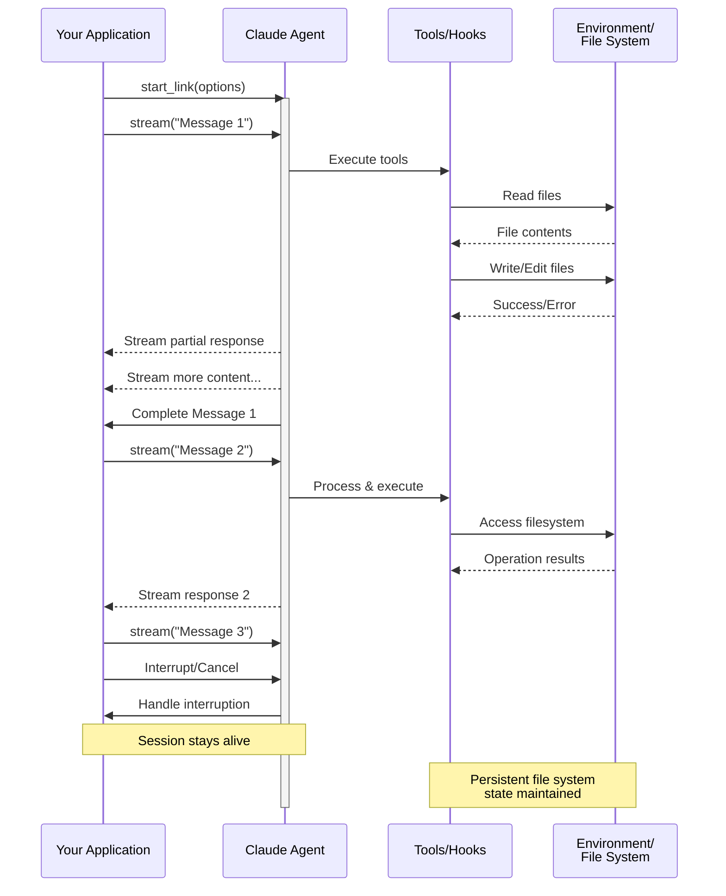

# Streaming Input

Understanding the two input modes for the Claude Code Elixir SDK and when to use each.

> **Official Documentation:** This guide is based on the [official Claude Agent SDK documentation](https://platform.claude.com/docs/en/agent-sdk/streaming-vs-single-mode). Examples are adapted for Elixir.

---

## Overview

The Claude Agent SDK supports two distinct input modes for interacting with agents:

- **Streaming Input Mode** (Default & Recommended) - A persistent, interactive session
- **Single Message Input** - One-shot queries that use session state and resuming

This guide explains the differences, benefits, and use cases for each mode to help you choose the right approach for your application.

## Streaming Input Mode (Recommended)

Streaming input mode is the **preferred** way to use the Claude Agent SDK. It provides full access to the agent's capabilities and enables rich, interactive experiences.

It allows the agent to operate as a long-lived process that takes in user input, handles interruptions, surfaces permission requests, and handles session management.

### How It Works



### Benefits

- **Queued Messages** - Send multiple messages that process sequentially, with ability to interrupt
- **Tool Integration** - Full access to all tools and custom MCP servers during the session
- **Hooks Support** - Use lifecycle hooks to customize behavior at various points
- **Real-time Feedback** - See responses as they're generated, not just final results
- **Context Persistence** - Maintain conversation context across multiple turns naturally

### Implementation Example

```elixir
# Start a persistent session with tools
{:ok, session} = ClaudeCode.start_link(
  allowed_tools: ["Read", "Grep"]
)

# First message
session
|> ClaudeCode.stream("Analyze this codebase for security issues")
|> ClaudeCode.Stream.text_content()
|> Enum.each(&IO.write/1)

# Wait for conditions or user input
Process.sleep(2000)

# Follow-up message - context is maintained
session
|> ClaudeCode.stream("Now check the authentication module specifically")
|> ClaudeCode.Stream.text_content()
|> Enum.each(&IO.write/1)

# Clean shutdown
ClaudeCode.stop(session)
```

## Single Message Input

Single message input is simpler but more limited.

### When to Use Single Message Input

Use single message input when:

- You need a one-shot response
- You do not need image attachments, hooks, etc.
- You need to operate in a stateless environment, such as a lambda function

### Limitations

<div class="warning">

Single message input mode does **not** support:

- Direct image attachments in messages
- Dynamic message queueing
- Real-time interruption
- Hook integration
- Natural multi-turn conversations

</div>

### Implementation Example

```elixir
# Simple one-shot query
result =
  ClaudeCode.query("Explain the authentication flow",
    allowed_tools: ["Read", "Grep"]
  )

case result do
  {:ok, response} -> IO.puts(response.result)
  {:error, reason} -> IO.puts("Error: #{inspect(reason)}")
end

# Continue conversation with session management
result =
  ClaudeCode.query("Now explain the authorization process",
    continue: true
  )

case result do
  {:ok, response} -> IO.puts(response.result)
  {:error, reason} -> IO.puts("Error: #{inspect(reason)}")
end
```

## Next Steps

- [Streaming Output](streaming-output.md) - Character-level deltas and partial messages
- [Sessions](sessions.md) - Session management, resume, and forking
